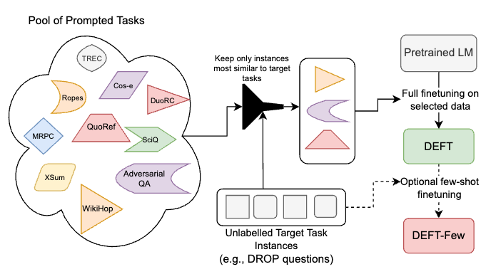

# DEFT: Data-Efficient FineTuning using cross-task nearest neighbors

Codebase for the paper **Data-Efficient Finetuning using cross-task nearest neighbors**. We show that using a small amount of task-specific unlabelled data to retrieve relevant examples out of a large pool of multi-task data results in models that perform better on the given task than models trained on the entire pool of data. Notably, this allows improved performance while **training on up to 50x less data than general multitask models**. An overview of our approach is below:




We evaluate our approach on a number of tasks, including the 11 tasks used to evaluate T0 and 3 additional tasks (DROP, Qasper, CaseHold) covering diverse domains:

| Model      | Average Accuracy across 14 Tasks |
| ----------- | ----------- |
| T0-3B      | 46.5%   |
| T5-XL | 35.9% |
| DEFT-XL (ours)   | **51.3%**        |

## Setup

First, install the required dependencies, preferably in a virtualenv: `pip install -r requirements.txt`. We primarily use `allennlp` for training and evaluation. If you wish to replicate the BM25 experiments, you'll also need a working Java 11+ installation (working `java` and `javac` commands), as per the [pyserini documentation](https://github.com/castorini/pyserini).

Most of our experiments work off the P3 data, specifically the subset used to train T0 (not the 'plus' variants). To download, use `python scripts/download_p3 --p3_output_file <output file>`. This should dump out the P3 data into a `.jsonl` in a usable format. This may take a day or so to run on a single machine due to the size of P3. Once downloaded, shuffling the file is recommended so that when creating the index you are not loading in datasets one by one (although ultimately this shouldn't make a big difference).

Once you have the P3 data in a (ideally shuffled) `.jsonl` file, name it `p3_train_instances_shuffled.jsonl`, then you can construct a FAISS index with a command like:
```
python scripts/index_p3_train_reps.py \
    --model google/t5-xl-lm-adapt \
    --output_prefix <folder containing p3 data file>
```

This will output a file like `p3_google-t5-xl-lm-adapt_OPQ8_512-HNSW512-PQ8_efConstruction-200_efSearch-128.index` in the same location as the P3 data. **Note that index construction can take as long as a week due to the large amount of P3 data**, and the process will use a large amount of RAM and may be killed after running a few days. The script will save periodic checkpoints and rerunning the same command will pick up from the last saved checkpoint.

TODO: provide our saved indices for easier reproduction.

### Evaluation Data

For the most part, we use huggingface datasets for evaluation and so it should download automatically. There are two exceptions:
- For Story Cloze, you need to download the data yourself. See [here](https://huggingface.co/datasets/story_cloze) for details.
- For QasperEvidence, we use custom dev/test splits. These files are available... TODO

## Retrieving

Once you have a finished indexing, you can retrieve qasper data using:
```
python scripts/retrieve_training_data.py \
    --p3_data <p3 jsonl location> \
    --index <index output file> \
    --model google/t5-xl-lm-adapt \
    --search_output <output filename for indices> \
    --training_data <output filename for retrieved data>
```
and retrieve data for all other datasets with:
```
python scripts/retrieve_training_data_rank.py \
    --p3_data <p3 jsonl location> \
    --index <index output file> \
    --model google/t5-xl-lm-adapt \
    --query_size 1000 \
    --num_neighbors_search 500 \
    --outfile_location <output folder for retrieved data>
```
Note this script will retrieve over all datasets and place files of form `{dataset}_{query_size}q_{num_neighbors}n.jsonl` in the `outfile_location`. Again, loading the index into memory can take alot of RAM, and retrieving can take a few hours.

Both scripts output `jsonl` files where each line is an input instance with form `{"input": <input>, "target": <target>, "index_id": <line number of datapoint in p3 data file>}`.

### BM25 Index

We use pyserini for BM25. Simply run `shell_scripts/create_pyserini_index.sh` with the appropriate arguments (data in a compatible format, output file, number of threads). See the pyserini documentation for more information.

You can then retrieve using `shell_scripts/retrieve_pyserini.sh`. You'll need to generate some queries files (e.g. by dumping out the relevant data from the readers). Please consult the script for more details.

### Super-Natural Instructions

Basically, follow the same instructions as for P3, but use `scrpts/index_ni_train_reps.py` (with a file called `ni_dump_raw.jsonl` containing the NI data to index). To retrieve, use `scripts/retrieve_training_data_ni.py`. This works similar to the Qasper retrieval. Most of the arguments for these two scripts are similar to the P3 case.

## Training

Once all the above is done, you can train models using `allennlp train` and the configs provided in `training_config`. These configs should largely work out of the box on a single GPU machine, so long as you set the required environment variables (or just replace them in the config directly). For example, to train a model on some retrieved data and evaluate it on RTE, do:
```bash
export TRAIN_DATA_PATH=retrieved_data.jsonl
export VALIDATION_DATASET_READER_NAME=rte_reader
allennlp train -s training_config/task_retrieved_only.jsonnet <model output folder>  --include-package attribution
```

Any reader defined in `attribution` can be used (see the readers in `huggingface_readers.py` for an example). Evaluation will run during training after each epoch. To replicate DEFT, take only the value calculated after the 5th epoch (not the best overall).

### CaseHOLD

For casehold, we retrieved using 1000 examples split from validation, and tested on the remaining data. To emulate this, make sure the `validataion_dataset_reader` has `"use_val_split": true`.

### DROP, QasperEvidence, Super-Natural Instructions

DROP, QasperEvidence, and Super-Natural Instructions use evaluation setups that we run after training, rather than during (like the other setups). See `shell_scripts/evaluate_{dataset}.sh` for the evaluation of each. Note that Super-Natural Instructions will perform evaluation over all evaluation tasks, but we usually only care about few to one tasks at any given time (see the paper for more details).

## Issues? Comments?

Please lodge an issue if you have any questions!